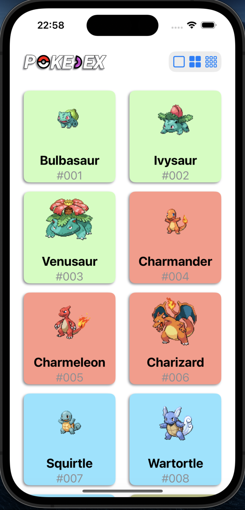

# Pokedex App

## Descrição

Este é um aplicativo de Pokedex desenvolvido em Swift, que permite aos usuários explorar informações detalhadas sobre todos os Pokémons disponíveis. O aplicativo consome dados da [PokéAPI](https://pokeapi.co/), proporcionando uma experiência rica e interativa, ideal para fãs de Pokémon e desenvolvedores que desejam aprender mais sobre a integração de APIs em Swift.

## Funcionalidades

- **Lista de Pokémons:** Exibe uma lista completa de Pokémons com imagens e nomes.
- **Detalhes do Pokémon:** Apresenta informações detalhadas como:
  - Tipos
  - Pesos e Alturas
  - Estatísticas (HP, Ataque, Defesa, etc.)
- **Interface Responsiva:** Adaptada para diferentes tamanhos de tela, incluindo iPhone e iPad.

## Screenshots

### Tela Inicial



### Detalhes do Pokémon


## Vídeo de Uso

<video width="240" height="420" controls>
  <source src="prints/PokedexVideo.mov" type="video/mp4">
  Seu navegador não suporta a tag de vídeo.
</video>

## Instalação

1. **Clone o repositório para sua máquina local:**
   ```bash
   git clone https://github.com/rafaalt/Pokedex.git
2. **Navegue até o diretório do projeto::**
   ```bash
   cd Pokedex
3. **Abra o projeto no Xcode:**
   ```bash
   open Pokedex.xcworkspace
4. **Compile e execute o aplicativo em um simulador ou dispositivo físico.**